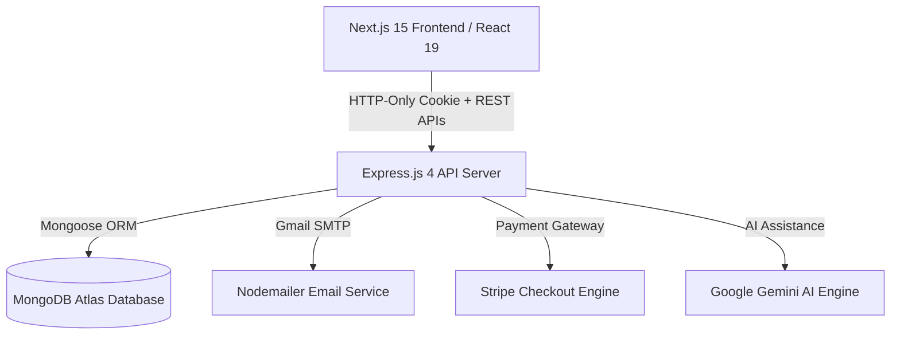

# DentalFlow™ - Enterprise Multi-Branch Healthcare SaaS Platform

[](https://nextjs.org/)
[](https://reactjs.org/)
[](https://expressjs.com/)
[](https://www.mongodb.com/)
[](https://stripe.com/)
[](LICENSE)

**DentalFlow™** is an enterprise-grade multi-branch healthcare practice management platform engineered for **Smile Dental Clinic Network (Canada)**. The platform unifies 6 active Canadian metro branches (Toronto Central, Vancouver Downtown, Calgary Beltline, Ottawa Centre, Mississauga City Centre, Montreal Square) into a single centralized system with real-time MongoDB Atlas integration, HTTP-Only JWT authentication, Stripe counter & online billing, EMR records, and role-based workflows across Patients, Doctors, Receptionists, and Administrators.

---

## 📑 Table of Contents
1. [Project Overview](#-project-overview)
2. [Key Features](#-key-features)
3. [System Architecture](#-system-architecture)
4. [Tech Stack](#-tech-stack)
5. [Folder Structure](#-folder-structure)
6. [Authentication & Security](#-authentication--security)
7. [Role-Based Access Control (RBAC)](#-role-based-access-control-rbac)
8. [Workflow Modules](#-workflow-modules)
   - [Patient Workflow](#-patient-workflow)
   - [Receptionist Workflow](#-receptionist-workflow)
   - [Doctor Workflow](#-doctor-workflow)
   - [Admin Workflow](#-admin-workflow)
9. [API Overview](#-api-overview)
10. [Database Schema & Models](#-database-schema--models)
11. [AI Dental Assistant Integration](#-ai-dental-assistant-integration)
12. [Stripe Payment Engine](#-stripe-payment-engine)
13. [Installation & Setup](#-installation--setup)
14. [Environment Variables](#-environment-variables)
15. [Deployment Guide](#-deployment-guide)
16. [Performance Optimizations](#-performance-optimizations)
17. [License](#-license)

---

## 🌐 Project Overview

DentalFlow™ eliminates fragmented clinic operations by providing:
- **Centralized EMR & Schedule Sync**: Seamless cross-branch appointment booking and electronic medical record synchronization.
- **Strict Role Isolation**: Customized portals for Patients, Doctors, Receptionists, and Administrators.
- **Enterprise Security**: HTTP-Only cookie tokens, bcrypt hashing, Gmail SMTP 6-digit OTP verification, rate limiting, and real-time audit logging.
- **Transparent Canadian Billing**: ODA/BCDA provincial fee guide adherence with Stripe online payment and PDF receipt generation.

---

## ✨ Key Features

- **Public Marketing Portal**: Interactive services catalog, doctor profiles, branch directory, and auto-triggering booking modal.
- **Real-Time Appointment Linking**: Public and authenticated bookings automatically resolve `patientId` and `doctorId` ObjectIds in MongoDB Atlas.
- **Live Reception Queue**: Real-time patient check-in, status transitions (`pending` → `confirmed` → `checked-in` → `in-progress` → `completed`), and express walk-in intake.
- **Doctor Clinical Suite**: Daily appointment schedule, EMR record viewing, digital prescription generation, and consultation notes.
- **Executive Admin Telemetry**: Total revenue analytics, doctor & receptionist staff provisioning, branch management, and audit log streaming.

---

## 🏗️ System Architecture



---

## 🛠️ Tech Stack

### Frontend
- **Framework**: Next.js 15.1 (App Router)
- **UI Library**: React 19, Tailwind CSS v4, Lucide React, Framer Motion
- **PDF Engine**: jsPDF & AutoTable
- **Notifications**: React Hot Toast

### Backend
- **Runtime**: Node.js v20+
- **Web Framework**: Express.js 4.21
- **Database**: MongoDB Atlas via Mongoose 8.8
- **Authentication**: JWT (JSON Web Tokens) in HTTP-Only Cookies
- **Email Service**: Nodemailer with Gmail SMTP
- **Payment Processing**: Stripe Node SDK v17

---

## 📁 Folder Structure

```text
dentalflow/
├── backend/
│   ├── src/
│   │   ├── config/          # Database & Environment configuration
│   │   ├── controllers/     # Express route controllers (Auth, Patient, Doctor, Reception, Admin)
│   │   ├── middleware/      # JWT Authentication & RBAC Middleware
│   │   ├── models/          # Mongoose Schemas (User, Appointment, Invoice, Prescription, AuditLog)
│   │   ├── routes/          # Express API Endpoints Router
│   │   ├── utils/           # Email templates & PDF helpers
│   │   └── app.js           # Express app setup & CORS options
│   ├── package.json
│   └── .env
└── frontend/
    ├── app/
    │   ├── dashboard/       # Protected Role Dashboards (Patient, Doctor, Reception, Admin)
    │   ├── login/           # Login & OTP Verification Page
    │   ├── register/        # Self-Registration Page
    │   └── page.jsx         # Main Landing Page & Hero Section
    ├── components/          # Reusable Components & Modals
    ├── context/             # AuthContext Provider
    ├── hooks/               # Custom React Hooks
    ├── lib/                 # API Client & Base Configuration
    ├── package.json
    └── next.config.mjs
```

---

## 🔐 Authentication & Security

- **HTTP-Only Cookies**: JWT access tokens are set as `httpOnly: true`, `secure: true` (production), `sameSite: "lax"`, and `path: "/"` to prevent XSS token theft.
- **OTP Verification**: Email verification codes generated using SHA-256 cryptographic hashes with a 10-minute expiry window.
- **CSRF & CORS Control**: Strict CORS origin verification matching exact requesting origins with credentials support.
- **No Token in LocalStorage**: User profile state is stored for instant rendering while security credentials remain strictly inside HTTP-Only cookies.

---

## 🛡️ Role-Based Access Control (RBAC)

| Role | Access Scope | Allowed Routes |
| :--- | :--- | :--- |
| **Patient** | Personal appointments, EMR, prescriptions, invoices, profile settings | `/dashboard/patient/*` |
| **Doctor** | Assigned patients, clinical schedule, consultation notes, Rx generator | `/dashboard/doctor/*` |
| **Receptionist** | Live clinic queue, walk-in intake, counter billing, appointment check-in | `/dashboard/reception/*` |
| **Admin** | Full executive panel, user CRUD, role changes, branch/doctor config, audit logs | `/dashboard/admin/*` |

---

## 🔄 Workflow Modules

### 👤 Patient Workflow
1. **Self-Registration**: Register with Email + OTP code verification.
2. **Appointment Booking**: Select Branch, Service, Doctor, Date, and Time. Auto-linked to `patientId` in MongoDB Atlas.
3. **EMR & Prescriptions**: View medical history, active prescriptions, and download PDF receipts/Rx.
4. **Stripe Online Billing**: Pay pending clinic invoices online with automatic status updates.

### 📋 Receptionist Workflow
1. **Live Queue**: View today's arrivals with status indicators (`checked-in`, `in-progress`, `completed`).
2. **Express Walk-In**: Register new walk-in patients directly into the queue.
3. **Counter Billing**: Issue invoices and record cash/manual card payments.

### 🩺 Doctor Workflow
1. **Schedule Overview**: View daily assigned appointments filtered by clinic branch.
2. **Clinical Notes & Rx**: Add consultation notes and generate electronic prescriptions.

### ⚙️ Admin Workflow
1. **User Management**: Provision new staff accounts, edit attributes, soft-delete, and reset passwords.
2. **Role Switching**: Change user roles instantly (`patient` ↔ `doctor` ↔ `receptionist` ↔ `admin`).
3. **Audit Telemetry**: View real-time security audit logs for all administrative actions.

---

## 🌐 API Overview

### Authentication
- `POST /api/v1/auth/register` - Patient registration
- `POST /api/v1/auth/verify-otp` - Verify email OTP
- `POST /api/v1/auth/login` - User login
- `POST /api/v1/auth/logout` - Clear auth cookies
- `GET /api/v1/auth/me` - Fetch authenticated profile

### Appointments
- `POST /api/v1/appointments` - Book appointment
- `GET /api/v1/appointments` - List appointments
- `PATCH /api/v1/appointments/:id/status` - Update status

### Reception & Live Queue
- `GET /api/v1/reception/queue` - Live queue stream
- `POST /api/v1/reception/walkin` - Register walk-in
- `POST /api/v1/reception/invoices` - Issue counter invoice
- `POST /api/v1/reception/invoices/:id/pay` - Record manual payment

### Admin User Management & RBAC
- `GET /api/v1/admin/users` - Search & filter users
- `POST /api/v1/admin/users` - Create staff/user account
- `PATCH /api/v1/admin/users/:id/role` - Update role
- `PATCH /api/v1/admin/users/:id/status` - Update status
- `POST /api/v1/admin/users/:id/reset-password` - Reset password
- `GET /api/v1/admin/logs` - Fetch system audit logs

---

## 🗄️ Database Schema & Models

- **User**: Name, Email, Password, Role, Phone, Branch, Department, Status, Permissions, EmailVerified.
- **Appointment**: PatientId (Ref User), PatientName, PatientPhone, PatientEmail, Treatment, AppointmentDate, AppointmentTime, BranchName, DoctorId, Status, Notes.
- **Invoice**: InvoiceNumber, PatientId, TotalAmount, Items, Status, PaymentMethod, DueDate.
- **Prescription**: PatientId, DoctorName, Medications, Instructions, DateIssued.
- **AuditLog**: PerformerId, PerformerName, Action, TargetUserId, Details, IpAddress.

---

## 🤖 AI Dental Assistant Integration

- Powered by Google Gemini AI with fallback clinic knowledge base.
- Answers clinical inquiries regarding 3D CBCT scans, Canadian provincial fee guides, sedation options, and clinic branch locations.

---

## 💳 Stripe Payment Engine

- Integrated Stripe Checkout API for web invoice payments.
- Webhook listener updates invoice status in MongoDB Atlas upon `checkout.session.completed`.

---

## 🚀 Installation & Setup

```bash
# 1. Clone Repository
git clone https://github.com/Taha-Siraj/dentalflow.git
cd dentalflow

# 2. Install Dependencies
cd backend && npm install
cd ../frontend && npm install

# 3. Start Development Servers
# Terminal 1: Backend Server (Port 5000)
cd backend && npm run dev

# Terminal 2: Frontend Client (Port 3000)
cd frontend && npm run dev
```

---

## 🔑 Test Credentials

| Role | Email | Password | Dashboard |
| :--- | :--- | :--- | :--- |
| **Administrator** | `admin@smilecare.ca` | `admin123` | `/dashboard/admin` |
| **Doctor** | `doctor@smilecare.ca` | `doctor123` | `/dashboard/doctor` |
| **Receptionist** | `reception@smilecare.ca` | `recep123` | `/dashboard/reception` |
| **Patient** | `patient@smilecare.ca` | `patient123` | `/dashboard/patient` |

---

## 📜 License
MIT License - Copyright (c) 2026 Smile Dental Clinic Canada.
